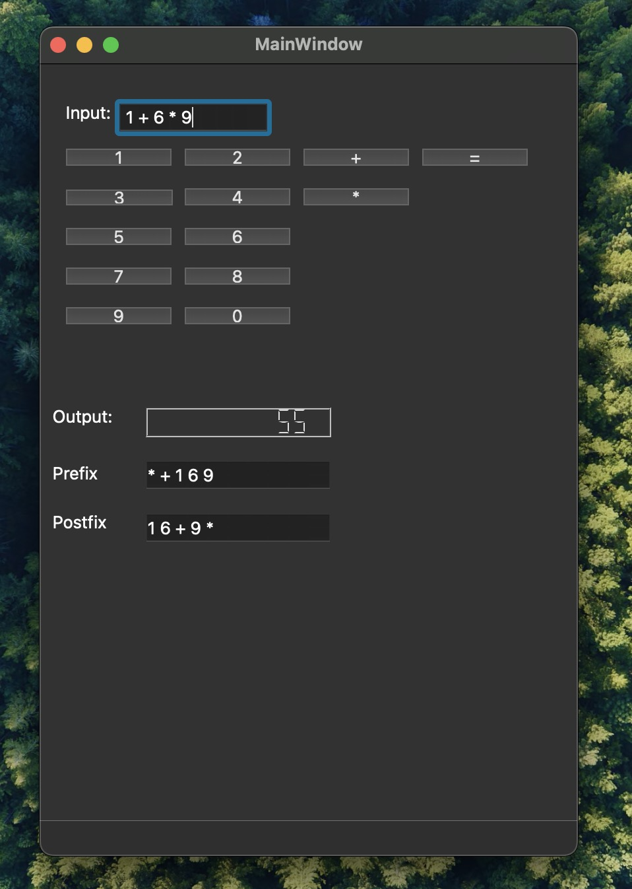

# PLC - Calculator

Steps to run the project:

1. Clone the repository.
2. <code>conda create --name env-plc-calculator python=3.8</code>
3. <code>conda activate env-plc-calculator</code>
4. <code>pip install -r requirements.txt</code>
5. <code>python main.py</code>

The report can be found at the repository named : "Biraj Koirala PLC-1.pdf"

The screenshot of the application is shown below:

